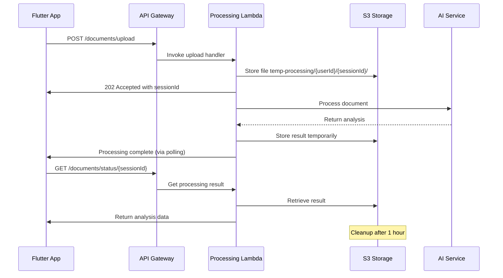

# Serenya AI Health Agent - REST API Technical Specification

**Document Version:** 1.0  
**Date:** August 30, 2025  
**Meeting Participants:** CTO, Backend Engineer, DevOps Engineer  

## Executive Summary

This document outlines the technical specification for Serenya AI Health Agent's REST API infrastructure, designed for device-only data storage with temporary server-side processing. The architecture ensures HIPAA compliance while providing efficient AI-powered health document analysis through a Flutter mobile application.

## 1. Architecture Overview

### 1.1 System Design Principles
- **Zero Persistent Storage**: No PHI stored permanently on servers
- **Temporary Processing**: Files processed and immediately discarded
- **Progressive Retry**: Intelligent retry mechanism for failed processing
- **Mobile-First**: Optimized for Flutter application performance
- **HIPAA Compliant**: End-to-end encryption and audit logging

### 1.2 Technology Stack
- **API Gateway**: AWS API Gateway with custom domain
- **Compute**: AWS Lambda functions (Node.js 18.x)
- **Storage**: Amazon S3 (temporary, encrypted)
- **Authentication**: JWT tokens with RS256 signing
- **Monitoring**: CloudWatch + X-Ray tracing
- **CDN**: CloudFront for static assets

## 2. API Endpoints Specification

### 2.1 Base Configuration
```
Base URL: https://api.serenya.health/v1
Content-Type: application/json
Authentication: Bearer JWT token
```

### 2.2 Authentication Endpoints

#### POST /auth/login
**Purpose**: Authenticate user and generate access token

**Request:**
```json
{
  "email": "user@example.com",
  "password": "hashedPassword",
  "deviceId": "unique-device-identifier"
}
```

**Response (200):**
```json
{
  "success": true,
  "data": {
    "accessToken": "eyJhbGciOiJSUzI1NiIs...",
    "refreshToken": "eyJhbGciOiJSUzI1NiIs...",
    "expiresIn": 3600,
    "tokenType": "Bearer",
    "userId": "usr_1234567890abcdef"
  },
  "metadata": {
    "requestId": "req_abc123",
    "timestamp": "2025-08-30T10:00:00Z"
  }
}
```

#### POST /auth/refresh
**Purpose**: Refresh expired access token

**Request:**
```json
{
  "refreshToken": "eyJhbGciOiJSUzI1NiIs..."
}
```

**Response (200):**
```json
{
  "success": true,
  "data": {
    "accessToken": "eyJhbGciOiJSUzI1NiIs...",
    "expiresIn": 3600,
    "tokenType": "Bearer"
  },
  "metadata": {
    "requestId": "req_def456",
    "timestamp": "2025-08-30T10:05:00Z"
  }
}
```

### 2.3 File Processing Endpoints

#### POST /documents/upload
**Purpose**: Upload and initiate processing of health documents

**Request (Multipart Form):**
```
Content-Type: multipart/form-data

file: [Binary file data] (required)
metadata: {
  "fileName": "lab_results.pdf",
  "fileType": "application/pdf",
  "documentType": "lab_report",
  "priority": "normal"
} (optional)
```

**Response (202 Accepted):**
```json
{
  "success": true,
  "data": {
    "sessionId": "ses_abc123def456",
    "uploadId": "upl_789xyz012",
    "status": "uploaded",
    "estimatedProcessingTime": 45,
    "statusUrl": "/documents/status/ses_abc123def456"
  },
  "metadata": {
    "requestId": "req_upload001",
    "timestamp": "2025-08-30T10:10:00Z"
  }
}
```

#### GET /documents/status/{sessionId}
**Purpose**: Check processing status of uploaded document

**Response (200 - Processing):**
```json
{
  "success": true,
  "data": {
    "sessionId": "ses_abc123def456",
    "status": "processing",
    "progress": 65,
    "estimatedTimeRemaining": 20,
    "retryCount": 0,
    "nextRetryAt": null
  },
  "metadata": {
    "requestId": "req_status001",
    "timestamp": "2025-08-30T10:11:00Z"
  }
}
```

**Response (200 - Completed):**
```json
{
  "success": true,
  "data": {
    "sessionId": "ses_abc123def456",
    "status": "completed",
    "result": {
      "extractedText": "Patient: John Doe\nDate: 2025-08-30...",
      "analysis": {
        "documentType": "lab_report",
        "keyFindings": [
          {
            "category": "blood_work",
            "finding": "Cholesterol levels elevated",
            "value": "245 mg/dL",
            "normalRange": "< 200 mg/dL",
            "severity": "moderate"
          }
        ],
        "recommendations": [
          "Consult physician about cholesterol management",
          "Consider dietary modifications"
        ]
      },
      "confidence": 0.94,
      "processingTimeMs": 43200
    }
  },
  "metadata": {
    "requestId": "req_result001",
    "timestamp": "2025-08-30T10:12:00Z"
  }
}
```

**Response (200 - Failed):**
```json
{
  "success": true,
  "data": {
    "sessionId": "ses_abc123def456",
    "status": "failed",
    "error": {
      "code": "PROCESSING_TIMEOUT",
      "message": "Document processing exceeded maximum time limit",
      "retryable": true
    },
    "retryCount": 2,
    "nextRetryAt": "2025-08-30T10:17:00Z"
  },
  "metadata": {
    "requestId": "req_status002",
    "timestamp": "2025-08-30T10:15:00Z"
  }
}
```

#### POST /documents/retry/{sessionId}
**Purpose**: Manually trigger retry for failed processing

**Response (202):**
```json
{
  "success": true,
  "data": {
    "sessionId": "ses_abc123def456",
    "status": "queued_for_retry",
    "retryCount": 3,
    "estimatedProcessingTime": 60
  },
  "metadata": {
    "requestId": "req_retry001",
    "timestamp": "2025-08-30T10:20:00Z"
  }
}
```

### 2.4 System Endpoints

#### GET /health
**Purpose**: System health check

**Response (200):**
```json
{
  "success": true,
  "data": {
    "status": "healthy",
    "version": "1.0.0",
    "uptime": 86400,
    "services": {
      "lambda": "healthy",
      "s3": "healthy",
      "database": "healthy"
    }
  },
  "metadata": {
    "requestId": "req_health001",
    "timestamp": "2025-08-30T10:25:00Z"
  }
}
```

#### GET /user/profile
**Purpose**: Get user profile information

**Response (200):**
```json
{
  "success": true,
  "data": {
    "userId": "usr_1234567890abcdef",
    "email": "user@example.com",
    "preferences": {
      "documentRetention": "device_only",
      "notifications": true,
      "language": "en"
    },
    "usage": {
      "documentsProcessed": 15,
      "monthlyLimit": 100,
      "resetDate": "2025-09-01T00:00:00Z"
    }
  },
  "metadata": {
    "requestId": "req_profile001",
    "timestamp": "2025-08-30T10:30:00Z"
  }
}
```

## 3. Error Response Standardization

### 3.1 Standard Error Format
```json
{
  "success": false,
  "error": {
    "code": "ERROR_CODE",
    "message": "Human-readable error description",
    "details": {
      "field": "Specific field validation errors",
      "constraints": ["validation constraint details"]
    },
    "retryable": true,
    "retryAfter": 30
  },
  "metadata": {
    "requestId": "req_error001",
    "timestamp": "2025-08-30T10:35:00Z",
    "traceId": "trace_xyz789"
  }
}
```

### 3.2 Error Codes

| Code | HTTP Status | Description | Retryable |
|------|-------------|-------------|-----------|
| `INVALID_REQUEST` | 400 | Malformed request body or parameters | No |
| `UNAUTHORIZED` | 401 | Invalid or expired authentication token | No |
| `FORBIDDEN` | 403 | Insufficient permissions | No |
| `NOT_FOUND` | 404 | Resource not found | No |
| `FILE_TOO_LARGE` | 413 | File exceeds 5MB limit | No |
| `UNSUPPORTED_FORMAT` | 415 | File format not supported | No |
| `RATE_LIMITED` | 429 | Too many requests | Yes |
| `PROCESSING_TIMEOUT` | 408 | Processing exceeded 3-minute limit | Yes |
| `SERVICE_UNAVAILABLE` | 503 | Temporary service outage | Yes |
| `INTERNAL_ERROR` | 500 | Unexpected server error | Yes |

## 4. Processing Workflow

### 4.1 Document Processing Pipeline



### 4.2 Progressive Retry Mechanism

**Retry Schedule:**
1. **First failure**: Wait 30 seconds
2. **Second failure**: Wait 2 minutes  
3. **Third failure**: Wait 5 minutes
4. **Fourth failure**: Mark as permanently failed

**Retry Logic Implementation:**
```javascript
const RETRY_DELAYS = [30000, 120000, 300000]; // milliseconds
const MAX_RETRIES = 3;

async function processWithRetry(sessionId, attempt = 0) {
  try {
    return await processDocument(sessionId);
  } catch (error) {
    if (attempt < MAX_RETRIES && isRetryableError(error)) {
      const delay = RETRY_DELAYS[attempt];
      await scheduleRetry(sessionId, delay, attempt + 1);
      return { status: 'scheduled_retry', nextRetryAt: Date.now() + delay };
    }
    throw error;
  }
}
```

## 5. AWS Infrastructure Architecture

### 5.1 Lambda Functions

#### Document Upload Handler
```yaml
Function Name: serenya-document-upload
Runtime: nodejs18.x
Memory: 512 MB
Timeout: 30 seconds
Environment Variables:
  - S3_BUCKET_NAME: serenya-temp-processing
  - JWT_SECRET: ${ssm:/serenya/jwt-secret}
  - MAX_FILE_SIZE: 5242880
IAM Role: serenya-upload-lambda-role
```

#### Document Processing Handler
```yaml
Function Name: serenya-document-processor
Runtime: nodejs18.x
Memory: 2048 MB
Timeout: 180 seconds
Environment Variables:
  - S3_BUCKET_NAME: serenya-temp-processing
  - AI_SERVICE_ENDPOINT: ${ssm:/serenya/ai-endpoint}
  - AI_API_KEY: ${ssm:/serenya/ai-api-key}
IAM Role: serenya-processor-lambda-role
```

#### Cleanup Handler
```yaml
Function Name: serenya-cleanup
Runtime: nodejs18.x
Memory: 256 MB
Timeout: 900 seconds
Schedule: rate(1 hour)
Environment Variables:
  - S3_BUCKET_NAME: serenya-temp-processing
  - CLEANUP_AGE_HOURS: 1
IAM Role: serenya-cleanup-lambda-role
```

### 5.2 S3 Bucket Configuration

```yaml
Bucket Name: serenya-temp-processing
Region: us-east-1
Versioning: Disabled
Encryption: AES-256 (SSE-S3)
Lifecycle Rules:
  - Rule Name: "temp-file-cleanup"
    Status: Enabled
    Expiration: 24 hours
    Abort Incomplete Multipart: 1 day

Folder Structure:
- temp-processing/
  - {userId}/
    - {sessionId}/
      - original/
        - document.{ext}
      - processed/
        - result.json
        - metadata.json

CORS Configuration:
AllowedOrigins: ["https://app.serenya.health"]
AllowedMethods: [GET, POST, PUT, DELETE]
AllowedHeaders: [Authorization, Content-Type, X-Session-Id]
MaxAge: 3600
```

### 5.3 API Gateway Configuration

```yaml
API Name: serenya-health-api
Stage: prod
Custom Domain: api.serenya.health
Certificate: ACM Certificate (*.serenya.health)

Throttling:
  Rate: 1000 requests/second
  Burst: 2000 requests

CORS Headers:
  Access-Control-Allow-Origin: "https://app.serenya.health"
  Access-Control-Allow-Methods: "GET,POST,PUT,DELETE,OPTIONS"
  Access-Control-Allow-Headers: "Authorization,Content-Type,X-Session-Id"

Request Validation:
  - Content-Type validation
  - Request size limits (5MB)
  - Required headers validation
```

### 5.4 IAM Roles and Policies

#### Upload Lambda Role
```json
{
  "Version": "2012-10-17",
  "Statement": [
    {
      "Effect": "Allow",
      "Action": [
        "s3:PutObject",
        "s3:PutObjectAcl"
      ],
      "Resource": "arn:aws:s3:::serenya-temp-processing/temp-processing/*"
    },
    {
      "Effect": "Allow",
      "Action": [
        "lambda:InvokeFunction"
      ],
      "Resource": "arn:aws:lambda:us-east-1:*:function:serenya-document-processor"
    },
    {
      "Effect": "Allow",
      "Action": [
        "logs:CreateLogGroup",
        "logs:CreateLogStream",
        "logs:PutLogEvents"
      ],
      "Resource": "*"
    }
  ]
}
```

#### Processor Lambda Role
```json
{
  "Version": "2012-10-17",
  "Statement": [
    {
      "Effect": "Allow",
      "Action": [
        "s3:GetObject",
        "s3:PutObject",
        "s3:DeleteObject"
      ],
      "Resource": "arn:aws:s3:::serenya-temp-processing/temp-processing/*"
    },
    {
      "Effect": "Allow",
      "Action": [
        "ssm:GetParameter"
      ],
      "Resource": [
        "arn:aws:ssm:us-east-1:*:parameter/serenya/ai-endpoint",
        "arn:aws:ssm:us-east-1:*:parameter/serenya/ai-api-key"
      ]
    }
  ]
}
```

## 6. Security Specifications

### 6.1 HIPAA Compliance Measures

**Data Encryption:**
- **In Transit**: TLS 1.3 for all API communications
- **At Rest**: AES-256 encryption for S3 storage
- **Application**: SQLite database encryption using sqflite_cipher

**Access Controls:**
- JWT token-based authentication with 1-hour expiration
- API rate limiting: 100 requests/minute per user
- IP allowlisting for admin endpoints
- Multi-factor authentication for admin access

**Audit Logging:**
```json
{
  "timestamp": "2025-08-30T10:40:00Z",
  "requestId": "req_audit001",
  "userId": "usr_1234567890abcdef",
  "action": "document_upload",
  "resource": "ses_abc123def456",
  "sourceIp": "192.168.1.100",
  "userAgent": "Serenya/1.0.0 (Flutter)",
  "outcome": "success",
  "details": {
    "fileSize": 2048576,
    "fileType": "application/pdf",
    "processingTime": 43200
  }
}
```

### 6.2 Data Privacy Controls

**No PHI Storage Policy:**
- All uploaded files deleted within 1 hour
- Processing results contain no direct PHI
- Only anonymized insights stored temporarily
- User sessions expire after inactivity

**Encryption Keys:**
- JWT signing keys rotated monthly
- S3 encryption keys managed by AWS KMS
- SQLite encryption keys generated per device

## 7. Performance Requirements

### 7.1 Response Time Targets

| Endpoint | Target Response Time | Max Response Time |
|----------|---------------------|-------------------|
| `/auth/login` | < 200ms | 500ms |
| `/documents/upload` | < 2s | 5s |
| `/documents/status` | < 100ms | 300ms |
| `/health` | < 50ms | 100ms |

### 7.2 Processing Timeouts

```javascript
const PROCESSING_CONFIG = {
  maxProcessingTime: 180000, // 3 minutes
  chunkSize: 1048576, // 1MB chunks for large files
  concurrentProcessing: 3, // Max 3 documents per user
  retryBackoff: {
    initial: 30000,    // 30 seconds
    multiplier: 4,     // 30s -> 2m -> 5m
    max: 300000        // 5 minutes max
  }
};
```

### 7.3 Mobile Optimization

**Request Optimization:**
- Gzip compression for all responses
- ETag headers for caching
- Minimal response payloads
- Progressive result loading

**Offline Capability:**
- SQLite local storage for offline access
- Queue failed uploads for retry
- Background sync when connection restored
- Local caching of processing results

## 8. Flutter Client Integration

### 8.1 HTTP Client Configuration

```dart
class SerenyaApiClient {
  static const String baseUrl = 'https://api.serenya.health/v1';
  static const Duration defaultTimeout = Duration(seconds: 30);
  static const Duration uploadTimeout = Duration(minutes: 2);
  
  final Dio _dio = Dio(BaseOptions(
    baseUrl: baseUrl,
    connectTimeout: defaultTimeout,
    receiveTimeout: defaultTimeout,
    headers: {
      'Content-Type': 'application/json',
      'User-Agent': 'Serenya/1.0.0 (Flutter)',
    },
  ));
}
```

### 8.2 File Upload Implementation

```dart
Future<UploadResponse> uploadDocument(File file) async {
  final formData = FormData.fromMap({
    'file': await MultipartFile.fromFile(
      file.path,
      filename: path.basename(file.path),
    ),
    'metadata': json.encode({
      'fileName': path.basename(file.path),
      'fileType': lookupMimeType(file.path),
      'documentType': 'health_document',
    }),
  });

  final response = await _dio.post(
    '/documents/upload',
    data: formData,
    options: Options(
      sendTimeout: uploadTimeout,
      headers: {'Authorization': 'Bearer $accessToken'},
    ),
  );

  return UploadResponse.fromJson(response.data);
}
```

### 8.3 Progressive Retry Implementation

```dart
class DocumentProcessor {
  Future<ProcessingResult> waitForCompletion(String sessionId) async {
    int pollCount = 0;
    const maxPolls = 60; // 5 minutes max polling
    
    while (pollCount < maxPolls) {
      final status = await getProcessingStatus(sessionId);
      
      switch (status.status) {
        case 'completed':
          return status.result!;
        case 'failed':
          if (status.retryCount < 3) {
            await Future.delayed(
              Duration(milliseconds: status.nextRetryAt! - DateTime.now().millisecondsSinceEpoch)
            );
            await retryProcessing(sessionId);
            continue;
          }
          throw ProcessingException('Processing failed after 3 retries');
        case 'processing':
          await Future.delayed(Duration(seconds: 5));
          break;
      }
      pollCount++;
    }
    
    throw TimeoutException('Processing timeout after 5 minutes');
  }
}
```

## 9. Database Schema (SQLite - Device Storage)

### 9.1 Local Database Structure

```sql
-- Documents table for local storage
CREATE TABLE documents (
    id TEXT PRIMARY KEY,
    file_name TEXT NOT NULL,
    file_path TEXT NOT NULL,
    file_type TEXT NOT NULL,
    upload_date INTEGER NOT NULL,
    processing_status TEXT DEFAULT 'pending',
    session_id TEXT,
    created_at INTEGER DEFAULT (strftime('%s', 'now')),
    updated_at INTEGER DEFAULT (strftime('%s', 'now'))
);

-- Processing results table
CREATE TABLE processing_results (
    id TEXT PRIMARY KEY,
    document_id TEXT NOT NULL,
    session_id TEXT NOT NULL,
    extracted_text TEXT,
    analysis_json TEXT,
    confidence_score REAL,
    processing_time_ms INTEGER,
    created_at INTEGER DEFAULT (strftime('%s', 'now')),
    FOREIGN KEY (document_id) REFERENCES documents(id)
);

-- User preferences table
CREATE TABLE user_preferences (
    key TEXT PRIMARY KEY,
    value TEXT NOT NULL,
    updated_at INTEGER DEFAULT (strftime('%s', 'now'))
);

-- Sync queue for offline operations
CREATE TABLE sync_queue (
    id TEXT PRIMARY KEY,
    action_type TEXT NOT NULL,
    payload TEXT NOT NULL,
    retry_count INTEGER DEFAULT 0,
    next_retry_at INTEGER,
    created_at INTEGER DEFAULT (strftime('%s', 'now'))
);
```

### 9.2 Encryption Configuration

```dart
// SQLite encryption setup
class DatabaseManager {
  static const String _databaseName = 'serenya_health.db';
  static const int _databaseVersion = 1;
  
  Future<Database> _initDatabase() async {
    final documentsDirectory = await getApplicationDocumentsDirectory();
    final path = join(documentsDirectory.path, _databaseName);
    
    // Generate or retrieve encryption key
    final encryptionKey = await _getOrCreateEncryptionKey();
    
    return await openDatabase(
      path,
      version: _databaseVersion,
      password: encryptionKey,
      onCreate: _createTables,
      onUpgrade: _upgradeDatabase,
    );
  }
}
```

## 10. Monitoring and Alerting

### 10.1 CloudWatch Metrics

**Custom Metrics:**
- `DocumentProcessingDuration` - Processing time per document
- `DocumentProcessingSuccess` - Success rate percentage
- `FileUploadSize` - Average file size uploaded
- `UserRetryRate` - Frequency of manual retries
- `S3CleanupSuccess` - Cleanup operation success rate

**Alarms:**
- Processing failure rate > 5%
- Average processing time > 2 minutes
- S3 cleanup failures
- Lambda function errors > 1%
- API Gateway 5xx errors > 0.1%

### 10.2 X-Ray Tracing

```javascript
// Trace document processing pipeline
const AWSXRay = require('aws-xray-sdk-core');
const AWS = AWSXRay.captureAWS(require('aws-sdk'));

exports.handler = async (event) => {
  const segment = AWSXRay.getSegment();
  
  // Trace upload phase
  const uploadSubsegment = segment.addNewSubsegment('document-upload');
  try {
    const uploadResult = await uploadToS3(event.file);
    uploadSubsegment.close();
    
    // Trace processing phase
    const processSubsegment = segment.addNewSubsegment('ai-processing');
    const result = await processDocument(uploadResult.key);
    processSubsegment.close();
    
    return result;
  } catch (error) {
    segment.addError(error);
    throw error;
  }
};
```

## 11. Deployment Specifications

### 11.1 Infrastructure as Code (CDK)

```typescript
// CDK Stack for Serenya Infrastructure
export class SerenyaInfrastructureStack extends Stack {
  constructor(scope: Construct, id: string, props?: StackProps) {
    super(scope, id, props);

    // S3 Bucket for temporary processing
    const tempBucket = new s3.Bucket(this, 'TempProcessingBucket', {
      bucketName: 'serenya-temp-processing',
      encryption: s3.BucketEncryption.S3_MANAGED,
      blockPublicAccess: s3.BlockPublicAccess.BLOCK_ALL,
      lifecycleRules: [{
        id: 'temp-file-cleanup',
        enabled: true,
        expiration: cdk.Duration.hours(24),
        abortIncompleteMultipartUploadAfter: cdk.Duration.days(1),
      }],
    });

    // Lambda Functions
    const uploadFunction = new lambda.Function(this, 'DocumentUploadFunction', {
      runtime: lambda.Runtime.NODEJS_18_X,
      handler: 'upload.handler',
      code: lambda.Code.fromAsset('lambda/upload'),
      memorySize: 512,
      timeout: cdk.Duration.seconds(30),
      environment: {
        S3_BUCKET_NAME: tempBucket.bucketName,
        JWT_SECRET: ssm.StringParameter.valueForStringParameter(this, '/serenya/jwt-secret'),
      },
    });

    // API Gateway
    const api = new apigateway.RestApi(this, 'SerenyaApi', {
      restApiName: 'Serenya Health API',
      domainName: {
        domainName: 'api.serenya.health',
        certificate: acm.Certificate.fromCertificateArn(this, 'ApiCert', certificateArn),
      },
      defaultCorsPreflightOptions: {
        allowOrigins: ['https://app.serenya.health'],
        allowMethods: ['GET', 'POST', 'PUT', 'DELETE'],
        allowHeaders: ['Authorization', 'Content-Type', 'X-Session-Id'],
      },
    });
  }
}
```

### 11.2 Environment Configuration

**Development Environment:**
```yaml
Environment: development
Region: us-east-1
S3 Bucket: serenya-temp-processing-dev
Lambda Memory: 1024 MB (for faster development)
CloudWatch Log Retention: 7 days
```

**Production Environment:**
```yaml
Environment: production
Region: us-east-1
S3 Bucket: serenya-temp-processing
Lambda Memory: 2048 MB
CloudWatch Log Retention: 30 days
Multi-AZ Deployment: Enabled
```

## 12. Cost Optimization

### 12.1 Resource Sizing

**Lambda Functions:**
- Upload Handler: 512 MB (cost-optimized for simple operations)
- Processor: 2048 MB (performance-optimized for AI processing)
- Cleanup: 256 MB (minimal resource usage)

**S3 Storage:**
- Standard tier for temporary storage
- Intelligent tiering disabled (files deleted within hours)
- Transfer acceleration disabled (mobile app usage)

### 12.2 Cost Monitoring

```yaml
Monthly Cost Targets:
  - Lambda: $50-100 (based on usage)
  - S3: $20-40 (temporary storage)
  - API Gateway: $30-60 (request volume)
  - Data Transfer: $20-30 (mobile optimization)
  - Total Target: $120-230/month

Cost Alarms:
  - Monthly spend > $300
  - Daily spend > $15
  - Unusual S3 storage growth
```

## 13. Testing Strategy

### 13.1 API Testing

```javascript
// Jest test example for document upload
describe('Document Upload API', () => {
  test('should accept valid PDF upload', async () => {
    const response = await request(app)
      .post('/documents/upload')
      .set('Authorization', `Bearer ${validToken}`)
      .attach('file', './test-files/sample.pdf')
      .field('metadata', JSON.stringify({
        fileName: 'sample.pdf',
        fileType: 'application/pdf'
      }));

    expect(response.status).toBe(202);
    expect(response.body.success).toBe(true);
    expect(response.body.data.sessionId).toBeDefined();
  });

  test('should reject files larger than 5MB', async () => {
    const response = await request(app)
      .post('/documents/upload')
      .set('Authorization', `Bearer ${validToken}`)
      .attach('file', './test-files/large-file.pdf');

    expect(response.status).toBe(413);
    expect(response.body.error.code).toBe('FILE_TOO_LARGE');
  });
});
```

### 13.2 Integration Testing

**Load Testing Scenarios:**
- 100 concurrent uploads
- Progressive retry simulation
- Network failure simulation
- Large file upload stress tests

## 14. Deployment Pipeline

### 14.1 CI/CD Configuration

```yaml
# GitHub Actions workflow
name: Deploy Serenya API
on:
  push:
    branches: [main]
    paths: ['api/**', 'infrastructure/**']

jobs:
  test:
    runs-on: ubuntu-latest
    steps:
      - uses: actions/checkout@v3
      - name: Run API tests
        run: npm test
      - name: Run security scan
        run: npm audit

  deploy:
    needs: test
    runs-on: ubuntu-latest
    steps:
      - name: Deploy to AWS
        run: |
          cdk deploy --require-approval never
          aws lambda update-function-code --function-name serenya-document-upload
```

### 14.2 Rollback Strategy

**Automated Rollback Triggers:**
- Error rate > 5% for 5 minutes
- Response time > 10 seconds
- CloudWatch alarm activation

**Manual Rollback Process:**
1. Revert Lambda function to previous version
2. Update API Gateway stage variables
3. Verify health check endpoints
4. Monitor error rates for 10 minutes

## 15. Implementation Timeline

### Phase 1: Foundation (Week 1-2)
- AWS infrastructure setup
- Basic authentication endpoints
- S3 bucket configuration
- Lambda function scaffolding

### Phase 2: Core Functionality (Week 3-4)
- Document upload implementation
- AI processing integration
- Status polling endpoints
- Basic error handling

### Phase 3: Reliability (Week 5-6)
- Progressive retry mechanism
- Comprehensive error handling
- Monitoring and alerting setup
- Security hardening

### Phase 4: Optimization (Week 7-8)
- Performance tuning
- Cost optimization
- Load testing and optimization
- Documentation completion

## 16. Security Checklist

### 16.1 Pre-Deployment Security Review

- [ ] JWT token validation implemented
- [ ] File type validation enforced
- [ ] File size limits enforced (5MB)
- [ ] Rate limiting configured
- [ ] CORS properly configured
- [ ] S3 bucket permissions restricted
- [ ] Lambda function permissions minimal
- [ ] Encryption at rest enabled
- [ ] TLS 1.3 enforced
- [ ] Audit logging implemented
- [ ] No PHI in logs confirmed
- [ ] Cleanup processes tested
- [ ] Error messages sanitized

### 16.2 HIPAA Compliance Verification

- [ ] Business Associate Agreement (BAA) with AWS signed
- [ ] Encryption standards met (AES-256)
- [ ] Access controls documented
- [ ] Audit trail complete
- [ ] Data retention policy enforced
- [ ] Breach notification procedures defined
- [ ] Employee access training completed
- [ ] Regular security assessments scheduled

## 17. Conclusion

This specification provides a comprehensive foundation for implementing the Serenya AI Health Agent REST API with device-only data storage and temporary server-side processing. The architecture balances performance, security, and cost efficiency while maintaining strict HIPAA compliance.

**Key Implementation Priorities:**
1. Zero persistent PHI storage
2. Robust retry mechanisms
3. Mobile-optimized performance
4. Comprehensive security measures
5. Cost-effective AWS resource utilization

**Next Steps:**
1. Review and approve this specification
2. Set up AWS infrastructure using CDK
3. Implement Lambda functions and API endpoints
4. Configure Flutter client integration
5. Conduct security review and penetration testing
6. Deploy to staging environment for testing

---

**Document Approval:**
- CTO: _________________ Date: _________
- Backend Engineer: _________________ Date: _________  
- DevOps Engineer: _________________ Date: _________