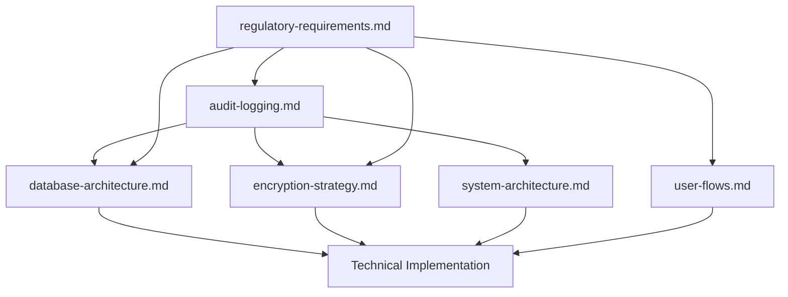

# Compliance Documentation

**Domain:** Legal & Regulatory Compliance Framework  
**Last Updated:** September 5, 2025  
**Status:** Complete - Ready for Implementation  
**Owner:** Chief Technology Officer & Compliance Team

---

## 📋 **Overview**

This folder contains comprehensive compliance documentation for Serenya AI Health Agent, ensuring adherence to healthcare data protection regulations, privacy laws, and security standards. The compliance framework is designed for global operation with privacy-by-design principles.

### **Regulatory Scope**
- **HIPAA** (Health Insurance Portability and Accountability Act) - US healthcare data protection
- **GDPR** (General Data Protection Regulation) - EU personal data protection  
- **CCPA** (California Consumer Privacy Act) - California residents' privacy rights
- **PCI DSS** (Payment Card Industry Data Security Standard) - Payment data protection
- **SOC 2 Type II** (Future certification target)

### **Compliance Philosophy**
- **Privacy by Design**: Compliance built into architecture from inception
- **Maximum Protection**: Meet highest global standards (HIPAA + GDPR)
- **Transparency First**: Clear communication about data practices
- **Audit-Ready**: Comprehensive documentation and automated audit trails
- **Continuous Monitoring**: Ongoing validation and improvement

---

## 📁 **Document Structure**

### **Core Documents**

#### **[audit-logging.md](./audit-logging.md)**
**Purpose**: Comprehensive audit trail system for compliance monitoring and incident investigation

**Key Components**:
- **5 Event Categories**: Authentication, data access, consent management, financial transactions, security events
- **Database Schema**: `audit_events` and `audit_event_summaries` tables with full encryption
- **Processing Strategy**: Real-time critical events + batch processing for standard events
- **Compliance Integration**: HIPAA, GDPR, and PCI DSS audit requirements
- **Retention Management**: Automated 7-year retention with secure deletion
- **Lambda Integration**: Auth, Process, and Payment function audit logging

**Dependencies**: 
- `database-architecture.md` (audit table schemas)
- `encryption-strategy.md` (security event integration)
- `system-architecture.md` (AWS CloudTrail integration)

**Implementation Status**: ✅ Complete schema + processing logic defined

---

#### **[regulatory-requirements.md](./regulatory-requirements.md)**
**Purpose**: Legal and regulatory compliance framework with detailed implementation requirements

**Key Sections**:

**HIPAA Compliance**:
- Administrative Safeguards (§164.308): Security management, workforce training, incident procedures
- Physical Safeguards (§164.310): Facility access, device controls, secure disposal
- Technical Safeguards (§164.312): Access control, audit controls, transmission security

**GDPR Compliance**:
- Data Protection Principles (Article 5): Lawfulness, purpose limitation, data minimization
- Legal Basis Tracking (Article 6): Consent management and processing justification
- Data Subject Rights (Articles 15-17): Access requests, erasure, portability

**Additional Frameworks**:
- CCPA consumer rights implementation
- FDA AI/ML guidance monitoring
- SOC 2 Type II preparation roadmap

**Implementation Status**: ✅ Complete framework + monitoring procedures defined

---

## 🔄 **Document Relationships**

### **Technical Integration Points**

**Cross-Document Dependencies**:
- **Audit Events** ↔ **Database Tables**: Audit storage schema and encryption requirements
- **Regulatory Requirements** ↔ **User Flows**: Consent collection points and privacy disclosures  
- **Compliance Framework** ↔ **Security Implementation**: Technical safeguards and audit controls
- **Data Retention** ↔ **System Architecture**: Automated cleanup and monitoring infrastructure

---

## 📊 **Compliance Requirements Matrix**

| Requirement | HIPAA | GDPR | CCPA | Implementation | Status |
|-------------|-------|------|------|----------------|--------|
| **Audit Logging** | ✅ Required | ✅ Required | ✅ Required | `audit_events` table + real-time processing | Complete |
| **Encryption at Rest** | ✅ Required | ✅ Required | ✅ Required | AWS KMS + field-level encryption | Complete |
| **Encryption in Transit** | ✅ Required | ✅ Required | ✅ Required | TLS 1.3 + certificate pinning | Complete |
| **Access Controls** | ✅ Required | ✅ Required | ✅ Required | Role-based access + biometric auth | Complete |
| **Consent Management** | ⚠️ Applicable | ✅ Required | ✅ Required | `consent_records` table + audit trail | Complete |
| **Data Subject Rights** | ⚠️ Limited | ✅ Required | ✅ Required | Access/erasure request handlers | Complete |
| **Incident Response** | ✅ Required | ✅ Required | ✅ Required | Security incident procedures | Complete |
| **Data Retention** | ✅ 6+ years | ✅ Varies | ✅ Varies | 7-year policy + automated cleanup | Complete |
| **Breach Notification** | ✅ 60 days | ✅ 72 hours | ✅ Required | Automated detection + notification | Complete |

---

## 🛡️ **Security & Privacy Implementation**

### **Data Classification**
- **PHI** (Protected Health Information): Medical documents, lab results, AI analysis
- **PII** (Personally Identifiable Information): User profiles, contact information
- **Payment Data**: Subscription information, transaction records (PCI DSS scope)
- **Authentication Logs**: Login events, security incidents
- **Consent Records**: Privacy preferences, consent timestamps

### **Encryption Strategy**
- **Server-Side**: AWS KMS with customer-managed keys for user data, payments, audit logs
- **Client-Side**: Device biometric authentication + local medical data encryption
- **Network**: TLS 1.3 + application-layer encryption for medical data transmission
- **Database**: Full table encryption (payments, audit) + field-level encryption (users, content)

### **Data Retention & Disposal**
- **Standard Retention**: 7 years for all compliance-related data
- **Secure Deletion**: Cryptographic key deletion + database overwrite
- **Legal Hold**: Suspension of deletion for litigation/investigation
- **Automated Cleanup**: Daily retention policy enforcement

---

## 📈 **Compliance Monitoring**

### **Automated Monitoring**
- **Monthly**: Internal compliance assessment with scoring
- **Quarterly**: Data subject rights report + privacy training review
- **Annually**: Full compliance audit + policy updates
- **Triggered**: Incident response + breach notification procedures

### **Key Performance Indicators**
- **Audit Log Coverage**: 100% of regulated activities logged
- **Data Subject Response Time**: <30 days (GDPR requirement)
- **Security Incident Response**: <15 minutes detection to containment
- **Encryption Compliance**: 100% of PHI/PII encrypted at rest and in transit
- **Access Review Completion**: Quarterly user access reviews 100% complete

### **External Validation**
- **Annual HIPAA Security Assessment**: Healthcare compliance firm
- **Bi-Annual GDPR Review**: Privacy law firm consultation  
- **Quarterly Penetration Testing**: Security assessment and validation
- **SOC 2 Type II Certification**: Year 2 target
- **ISO 27001 Consideration**: Year 3 evaluation

---

## 🚀 **Implementation Roadmap**

### **Phase 1: Foundation (Months 1-2)**
- [ ] Database audit table creation and encryption setup
- [ ] Basic audit logging integration in Lambda functions
- [ ] Consent management system implementation
- [ ] Data classification and handling procedures

### **Phase 2: Advanced Features (Months 3-4)**
- [ ] Complete data subject rights request automation
- [ ] Security incident response automation
- [ ] Compliance reporting dashboard
- [ ] External audit preparation

### **Phase 3: Optimization (Months 5-6)**  
- [ ] Performance optimization for audit logging
- [ ] Advanced analytics and anomaly detection
- [ ] SOC 2 Type II preparation
- [ ] Compliance training automation

---

## 📋 **Action Items & Responsibilities**

### **Immediate Actions (Next 30 Days)**
- [ ] **CTO**: Review and approve final compliance framework
- [ ] **Engineering**: Implement audit logging database schema
- [ ] **Engineering**: Integrate audit events in Lambda functions  
- [ ] **Legal**: Validate GDPR data processing activity descriptions
- [ ] **Product**: Integrate consent collection in user onboarding flow

### **Ongoing Responsibilities**
- **Chief Technology Officer**: Overall compliance oversight and policy approval
- **Engineering Team**: Technical implementation and maintenance
- **Product Team**: User-facing privacy features and consent flows
- **Legal Counsel**: Regulatory interpretation and policy updates
- **Compliance Auditor**: Monthly assessments and external audit coordination

---

## 🔗 **Related Documentation**

### **Technical Architecture**
- [`../technical/database-architecture.md`](../technical/database-architecture.md) - Data storage and encryption schemas
- [`../technical/encryption-strategy.md`](../technical/encryption-strategy.md) - Security implementation details  
- [`../technical/system-architecture.md`](../technical/system-architecture.md) - AWS infrastructure compliance
- [`../technical/api-contracts.md`](../technical/api-contracts.md) - Data processing API specifications

### **Product & User Experience**
- [`../product/user-flows.md`](../product/user-flows.md) - Consent collection and privacy disclosure points
- [`../product/ui-specifications.md`](../product/ui-specifications.md) - Privacy settings and data management UI

### **Development Process**
- [`../technical/implementation-roadmap.md`](../technical/implementation-roadmap.md) - Compliance milestone integration
- [`../../CLAUDE.md`](../../CLAUDE.md) - Development guidelines including compliance considerations

---

## 📞 **Contact & Support**

**Primary Contacts**:
- **Compliance Questions**: Chief Technology Officer
- **Technical Implementation**: Engineering Team Lead  
- **Legal/Regulatory**: Legal Counsel
- **External Audits**: Compliance Program Manager

**Document Maintenance**:
- **Review Frequency**: Quarterly or upon regulatory changes
- **Update Process**: Version control with signed commits
- **Approval Required**: CTO approval for policy changes
- **Distribution**: All team members with compliance responsibilities

---

**Document Status**: ✅ Complete - Implementation Ready  
**Next Review Date**: December 5, 2025  
**Compliance Framework Version**: 1.0  
**Regulatory Coverage**: HIPAA + GDPR + CCPA + PCI DSS