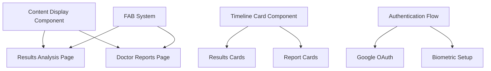

# Product Documentation

**Domain:** Product Strategy, Requirements & User Experience Design  
**Last Updated:** September 5, 2025  
**Status:** Complete - Implementation Ready  
**Owner:** Product Team & Design Lead

---

## 📋 **Overview**

This folder contains comprehensive product documentation for Serenya AI Health Agent, covering product strategy, user experience design, technical specifications, and business model. All documents are finalized and ready for development implementation.

### **Product Vision**
Serenya is positioned as an **AI Health Agent** - "Your friendly AI nurse that helps you understand your lab results and empowers better conversations with your healthcare provider." The product provides medical interpretation assistance while strengthening patient-doctor relationships through better preparation and understanding.

### **Core Value Proposition**
- **Clarity**: Medical interpretation in plain language you can understand
- **Confidence**: Feel prepared and empowered in healthcare conversations  
- **Context**: Understand your health story over time
- **Connection**: Strengthen your relationship with healthcare providers

---

## 📁 **Document Structure**

### **Core Product Strategy**

#### **[Serenya_PRD_v2.md](./Serenya_PRD_v2.md)**
**Purpose**: Primary product requirements document defining complete product vision and implementation strategy

**Key Components**:
- **Strategic Positioning**: AI Health Agent for medical interpretation (non-medical device classification)
- **Target Users**: Adults 25-55 seeking health clarity and empowerment
- **Core Features**: Document upload, AI analysis, timeline tracking, doctor reports (premium)
- **Business Model**: Freemium with €9.99/month or €99/year premium subscriptions
- **Technical Requirements**: HIPAA/GDPR compliance, FHIR schema, local-only medical data storage
- **Regulatory Strategy**: Non-medical device positioning eliminates FDA requirements while maintaining functionality

**Implementation Status**: ✅ Complete requirements with full technical specifications

---

#### **[Serenya_PRFAQ.md](./Serenya_PRFAQ.md)**
**Purpose**: Product positioning and frequently asked questions for external communication and team alignment

**Key Sections**:
- **Press Release**: Market positioning and launch messaging
- **Value Differentiation**: Unique position vs "Dr. Google" and generic health tools
- **Privacy Architecture**: Files processed then deleted, only structured data retained locally
- **Medical Disclaimers**: Clear positioning as interpretation assistance, not medical advice
- **Regulatory Benefits**: 80% functionality with 90% reduced legal risk and faster implementation

**Use Cases**: Marketing messaging, investor communications, team onboarding, FAQ responses

---

#### **[Serenya_Reviews.md](./Serenya_Reviews.md)**
**Purpose**: Sample user reviews demonstrating target user sentiment and key value propositions

**User Sentiment Themes**:
- **Life-changing clarity**: Understanding lab results reduces anxiety and uncertainty
- **Trusted health companion**: Personal medical assistant that knows user history
- **Simple, supportive, essential**: Effortless integration into health routine
- **Peace of mind**: Empowerment through better healthcare preparation

**Product Validation**: Reviews confirm core value props resonate with target demographic

---

### **User Experience Design**

#### **[ui-specifications.md](./ui-specifications.md)**
**Purpose**: Complete UI design system and component specifications for mobile app development

**Design System**:
- **Color Palette**: Blue (AI analysis), green (premium features), semantic colors with WCAG AA compliance
- **Typography**: Inter font family with defined hierarchy (headings, body, UI text)
- **Spacing System**: 8px base unit with consistent spacing scale
- **Component Library**: Shared components for timeline, content display, authentication

**Screen Specifications**:
- **Timeline View**: Main dashboard with upload button, content cards, empty state
- **Content Display**: Shared component for Results and Reports with tab system and FAB integration
- **Sign-up Flow**: 4-slide onboarding with Google OAuth and consent management
- **Settings Menu**: Profile, biometrics, premium subscription, privacy controls

**Accessibility**: WCAG AA compliance with focus management, high contrast, and touch accessibility

---

#### **[user-flows.md](./user-flows.md)**
**Purpose**: Comprehensive user journey mapping with detailed flow specifications and error handling

**Primary User Journeys**:
- **Document Analysis Flow**: Upload → Processing → Results → Understanding (3-5 minutes)
- **Interactive Conversation Flow**: Questions → AI responses → Continued dialogue
- **Authentication & Security Flow**: Onboarding → Google sign-in → Biometric setup
- **Premium Feature Flow**: Discovery → Preview → Subscription → Feature access
- **Error Recovery Flows**: Network issues, authentication failures, processing errors

**Emotional Journey Design**:
- **First-time users**: Anxiety → Confidence → Understanding → Empowerment
- **Returning users**: Comfortable routine with advanced feature discovery
- **Premium users**: Deep insights and comprehensive health relationship building

---

## 💼 **Business Model & Strategy**

### **Freemium Subscription Model**
- **Free Tier**: Basic medical interpretation + analysis + export summary PDF
- **Premium Tier**: €9.99/month or €99/year
  - Historical context + trend insights
  - Doctor-ready PDF reports with AI nurse insights
  - Comprehensive health relationship tracking
- **Conversion Strategy**: One free doctor report within 7 days of sign-up

### **Market Positioning**
- **Unique Position**: AI nurse/interpretation assistant for lab results
- **Differentiation**: Personal health relationship vs one-time tools
- **Target Market**: Health-conscious adults seeking clarity and healthcare empowerment
- **Global Reach**: HIPAA + GDPR compliance enables worldwide deployment

### **Regulatory Advantages**
- **Non-Medical Device Classification**: No FDA/CE marking required
- **Faster Time to Market**: 3-6 months vs 12-18 months for medical device
- **Reduced Legal Risk**: Standard business insurance sufficient
- **Implementation Benefits**: No clinical validation studies or medical director required

---

## 🎨 **Design System Architecture**

### **Visual Design Principles**
- **Warm Confidence**: Approachable yet professional medical interface
- **Empathy**: Understanding user anxiety around medical information
- **Custom Serenya Experience**: Unique, memorable interaction patterns
- **Accessibility First**: WCAG AA compliance for inclusive design
- **Mobile-First**: Primary focus on 320-375px screen widths

### **Component Reuse Strategy**

### **Navigation Architecture**
- **Hub-and-Spoke Model**: Timeline View as central hub
- **3 Primary Screens**: Timeline, Results Analysis, Doctor Reports
- **2 Support Flows**: Onboarding, Settings
- **Shared Components**: Content display, FAB system, authentication

---

## 🔄 **User Journey Success Metrics**

### **Core Performance Indicators**
- **Upload Success Rate**: >95% successful document processing
- **Time to Value**: <3 minutes from upload to results viewing
- **Authentication Success**: >98% successful biometric authentication
- **Premium Conversion**: >15% of active users upgrade to premium
- **User Retention**: >70% return within 7 days of first use

### **Emotional Journey Validation**
- **Confidence Building**: Survey feedback on trust and understanding
- **Anxiety Reduction**: Before/after emotional state measurement
- **Empowerment**: Users report feeling more informed about health
- **Satisfaction**: >4.5/5 average app store rating target

---

## 🚀 **Implementation Roadmap**

### **Phase 1: Core Features (Months 1-2)**
- [ ] Authentication and onboarding flow implementation
- [ ] Document upload and AI processing pipeline
- [ ] Timeline view and results display
- [ ] Basic chat functionality with suggested questions

### **Phase 2: Premium Features (Months 2-3)**
- [ ] Historical analysis and trend tracking
- [ ] Doctor report generation and PDF export
- [ ] Premium subscription and payment integration
- [ ] Advanced chat features and conversation history

### **Phase 3: Polish & Launch (Month 3)**
- [ ] UI/UX refinement based on testing feedback
- [ ] Performance optimization and error handling
- [ ] Accessibility compliance validation
- [ ] App store submission and launch preparation

---

## 📊 **Technical Integration Points**

### **Database Requirements**
- **User Data**: `users`, `consent_records`, `subscriptions` tables
- **Medical Content**: `serenya_content`, `lab_results`, `vitals` tables (local-only)
- **Interactions**: `chat_messages`, `chat_options` tables
- **All schemas defined in** [`../technical/database-architecture.md`](../technical/database-architecture.md)

### **API Integration**
- **Authentication**: Google OAuth with biometric setup
- **Document Processing**: Upload → S3 → AI analysis → Local storage
- **Chat System**: Real-time messaging with AI responses
- **Premium Features**: Subscription management and report generation
- **All endpoints defined in** [`../technical/api-contracts.md`](../technical/api-contracts.md)

### **Security & Compliance**
- **Local-Only Medical Data**: Files processed then deleted, structured data stored locally
- **Encryption Strategy**: Biometric authentication + field-level encryption
- **Regulatory Compliance**: HIPAA, GDPR, CCPA requirements built-in
- **Full specifications in** [`../technical/encryption-strategy.md`](../technical/encryption-strategy.md)

---

## 📋 **Action Items & Next Steps**

### **Immediate Development Priorities**
- [ ] **Mobile Architecture**: Flutter app structure with state management
- [ ] **Backend Services**: AWS Lambda functions for document processing
- [ ] **Database Setup**: PostgreSQL schema creation with encryption
- [ ] **Authentication**: Google OAuth integration with biometric setup
- [ ] **UI Implementation**: Design system components in Flutter

### **Quality Assurance**
- [ ] **Usability Testing**: User journey validation with target demographic
- [ ] **Accessibility Testing**: WCAG AA compliance verification
- [ ] **Security Testing**: Encryption and authentication validation
- [ ] **Performance Testing**: Upload processing and response times
- [ ] **Compliance Review**: HIPAA/GDPR requirements verification

### **Launch Preparation**
- [ ] **App Store Assets**: Screenshots, descriptions, metadata
- [ ] **Marketing Materials**: Landing page, press kit, user guides
- [ ] **Support Documentation**: Help articles, FAQ, troubleshooting
- [ ] **Analytics Setup**: User behavior tracking and conversion metrics
- [ ] **Beta Testing Program**: Limited release for feedback and refinement

---

## 🔗 **Related Documentation**

### **Technical Architecture**
- [`../technical/database-architecture.md`](../technical/database-architecture.md) - Data models and storage specifications
- [`../technical/encryption-strategy.md`](../technical/encryption-strategy.md) - Security implementation details
- [`../technical/system-architecture.md`](../technical/system-architecture.md) - AWS infrastructure and services
- [`../technical/api-contracts.md`](../technical/api-contracts.md) - API endpoints and data contracts
- [`../technical/flutter-app-architecture.md`](../technical/flutter-app-architecture.md) - Mobile app implementation

### **Compliance & Legal**
- [`../compliance/audit-logging.md`](../compliance/audit-logging.md) - Regulatory audit requirements
- [`../compliance/regulatory-requirements.md`](../compliance/regulatory-requirements.md) - HIPAA, GDPR, CCPA compliance framework

### **Development Process**
- [`../../CLAUDE.md`](../../CLAUDE.md) - Development guidelines and best practices
- [`../technical/implementation-roadmap.md`](../technical/implementation-roadmap.md) - Technical implementation timeline

---

## 📞 **Document Ownership & Updates**

**Primary Contacts**:
- **Product Strategy**: Product Manager
- **User Experience**: UX Design Lead
- **Technical Integration**: Engineering Team Lead
- **Business Model**: Chief Technology Officer

**Review Schedule**:
- **Product Requirements**: Updated as needed based on user feedback and market research
- **UI Specifications**: Updated during development sprints with design iterations
- **User Flows**: Validated through user testing and updated based on findings
- **Business Model**: Reviewed quarterly with pricing and feature optimization

**Change Management**:
- **Version Control**: All documents versioned with clear change logs
- **Stakeholder Review**: Product changes require cross-team approval
- **Implementation Impact**: Technical team consulted for feasibility assessment
- **User Impact**: UX validation required for significant flow changes

---

**Document Status**: ✅ Complete Product Specification  
**Implementation Readiness**: Ready for development sprint planning  
**Cross-References**: All technical dependencies identified and documented  
**Next Milestone**: Mobile architecture implementation + backend service setup